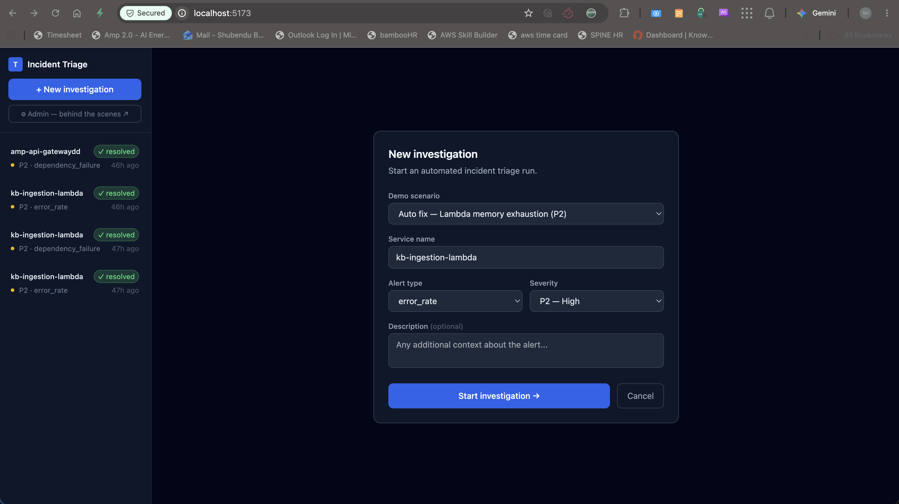
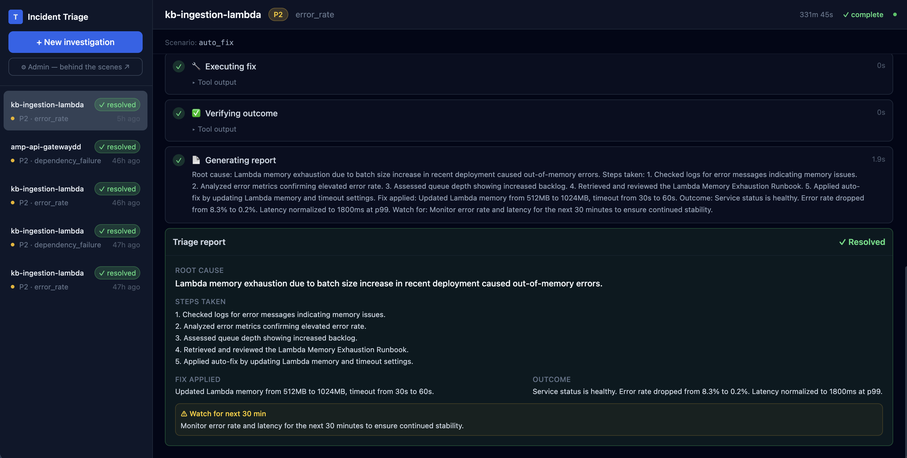
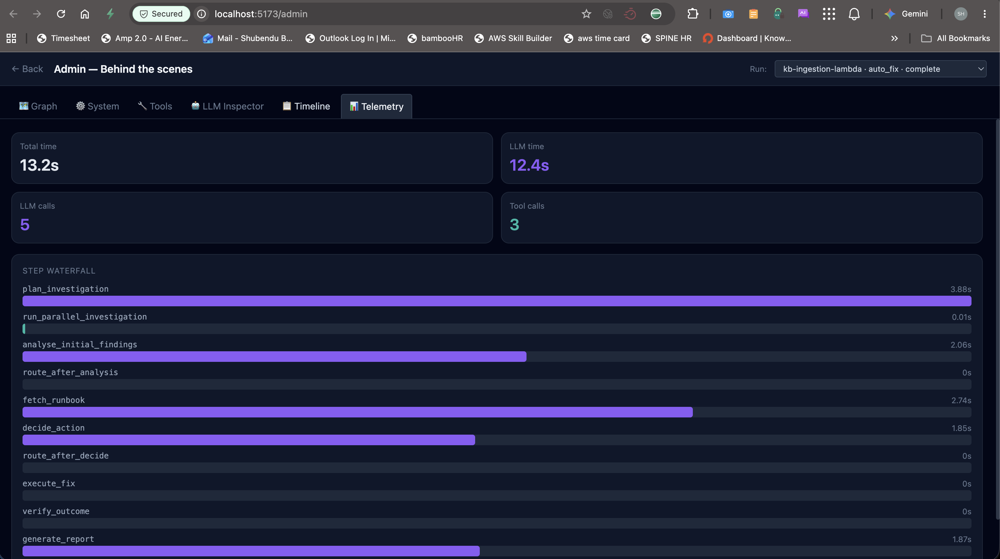
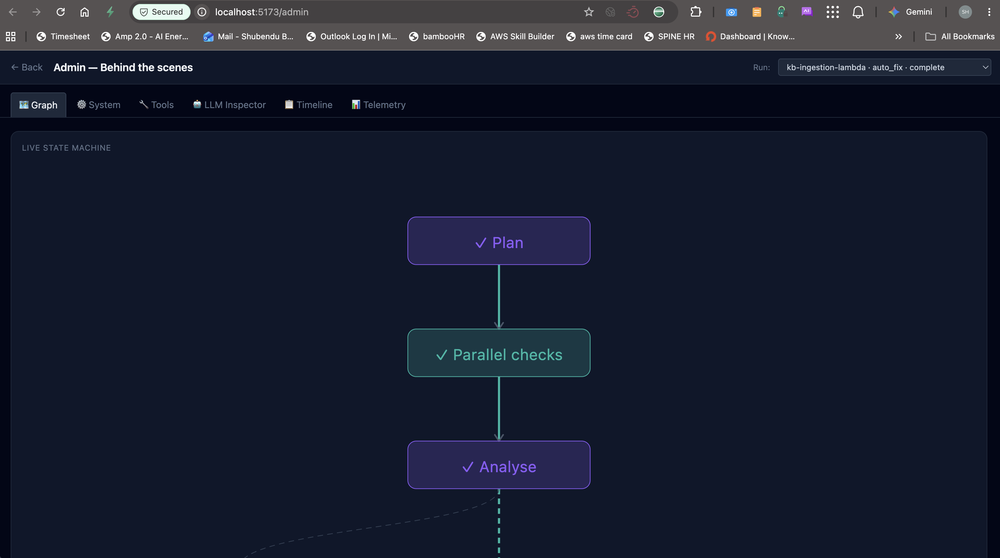
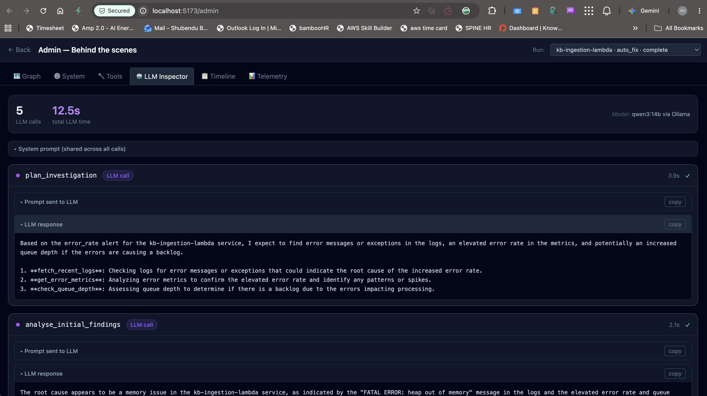

# Incident Triage Agent

An AI agent that automates platform engineering incident triage. When a service alert fires, the agent investigates logs, metrics, queue depth, and runbooks — then either fixes the issue automatically or presents options for operator approval before taking any risky action.

**Built with:** LangGraph · FastAPI · React · Ollama (offline) / OpenAI (online)

---

## What it does

On-call engineers today spend 30–90 minutes manually diagnosing incidents. This agent does the same investigation in 2–5 minutes:

1. Receives an alert (service name, type, severity)
2. Runs parallel checks — logs, metrics, queue depth — simultaneously
3. Analyses findings and forms a root cause hypothesis
4. Fetches the relevant runbook
5. Decides: auto-fix (low risk) or pause and ask the operator (high risk / P1)
6. Applies the fix, verifies the outcome, generates a structured report

The operator is only involved when it matters — capacity changes, P1 incidents, external AWS issues.

---

## Demo scenarios

Three pre-built scenarios demonstrate different agent paths:

### Scenario A — Auto fix (Lambda memory exhaustion)
**Alert:** `kb-ingestion-lambda | error_rate > 5% | P2`

The agent identifies JavaScript heap OOM errors, matches the Lambda Memory runbook, determines the fix is low-risk and reversible, and applies it automatically — no human needed.

```
plan → parallel_investigation → analyse → fetch_runbook → decide(auto_fix)
     → execute_fix → verify → report
```
Human interventions: **0**

---

### Scenario B — External dependency (Bedrock latency)
**Alert:** `amp-api-gateway | latency_p99 > 3000ms | P2`

The agent finds low error rate but extreme latency. Deep diagnosis reveals AWS Bedrock is degraded in us-east-1. Since it's an external AWS issue, the agent pauses and presents three mitigation options. Operator picks response caching.

```
plan → parallel_investigation → analyse → deep_diagnosis → fetch_runbook
     → decide(needs_approval) → ⏸ human_checkpoint → execute_approved_fix
     → verify → report
```
Human interventions: **1**

---

### Scenario C — Cascading failure (DynamoDB + SQS)
**Alert:** `workspace-api | error_rate > 20% | P1`

DynamoDB write capacity at 99% is causing API 500s, which trigger an SQS retry storm (8,400 messages). P1 severity always requires operator approval. Agent recommends pausing the SQS consumer before scaling DynamoDB.

```
plan → parallel_investigation → analyse → deep_diagnosis → fetch_runbook
     → decide(needs_approval, P1 override) → ⏸ human_checkpoint
     → execute_approved_fix → verify → report
```
Human interventions: **1**

---

## Architecture

```
┌─────────────────────────────────────────────────────────────┐
│  React Frontend  (Vite + Tailwind)                          │
│  Sidebar · Step feed · HITL approval · Admin dashboard      │
└────────────────────────┬────────────────────────────────────┘
                         │  HTTP + WebSocket
┌────────────────────────▼────────────────────────────────────┐
│  FastAPI Backend                                             │
│  REST API · WebSocket streaming · Background task runner    │
└────────────────────────┬────────────────────────────────────┘
                         │
┌────────────────────────▼────────────────────────────────────┐
│  LangGraph Agent  (StateGraph)                              │
│  12 nodes · Conditional routing · MemorySaver checkpoints   │
│  interrupt_before for HITL · asyncio parallel tools         │
└──────────────┬───────────────────────┬──────────────────────┘
               │                       │
┌──────────────▼───────┐  ┌────────────▼──────────────────────┐
│  LLM Layer           │  │  Tool Layer  (14 mock tools)       │
│  Ollama (offline)    │  │  Investigation · Diagnosis         │
│  OpenAI  (online)    │  │  Fix actions · Verification        │
│  Swap with 1 env var │  │  Swap bodies for real boto3        │
└──────────────────────┘  └───────────────────────────────────┘
```

### LangGraph state machine

```
START
  └─▶ plan_investigation          (LLM: read alert, plan checks)
        └─▶ run_parallel_investigation  (3 tools simultaneously)
              └─▶ analyse_initial_findings  (LLM: form hypothesis)
                    ├─▶ deep_diagnosis      (if root cause unclear)
                    │     └─▶ fetch_runbook
                    └─▶ fetch_runbook       (if root cause clear)
                          └─▶ decide_action  (LLM + policy rules)
                                ├─▶ execute_fix          (auto_fix path)
                                ├─▶ human_checkpoint ⏸   (needs_approval)
                                │     └─▶ execute_approved_fix
                                └─▶ cannot_fix            (escalate)
                                      └─▶ verify_outcome
                                            └─▶ generate_report
                                                  └─▶ END
```

**Why LangGraph over a custom loop:**
- Graph structure is explicit and inspectable — routing is declared, not buried in if/else
- HITL is a first-class feature via `interrupt_before` — not a workaround
- MemorySaver checkpoints every state transition — supports pause/resume across HTTP requests
- P1 policy enforced structurally in routing code, not delegated to LLM judgment

---

## Tech stack

| Layer | Technology | Why |
|---|---|---|
| Agent orchestration | LangGraph | Explicit graph, native HITL, checkpointing |
| LLM | Ollama / OpenAI | Swap with one env var — works fully offline |
| Backend | FastAPI + uvicorn | Async-native, WebSocket support, BackgroundTasks |
| Real-time | WebSocket | Push steps to UI as they complete |
| Database | SQLite + SQLAlchemy | Zero setup, portable to Postgres |
| Frontend | React + Vite | Simple state, no router needed |
| Styling | Tailwind CSS | Utility-first, dark theme |

---

## Prerequisites

- **Python 3.11+**
- **Node.js 18+**
- **Ollama** — for offline mode: https://ollama.com

---

## Setup

### 1. Clone the repo

```bash
git clone https://github.com/shubendu-intuitive/incident-triage-agent.git
cd incident-triage-agent
```

### 2. Ollama setup (offline mode — one time)

```bash
ollama pull qwen3:14b      # ~9GB
ollama serve               # starts on http://localhost:11434
```

> Skip this if you plan to use OpenAI.

### 3. Backend

```bash
cd backend
python -m venv venv
source venv/bin/activate       

pip install -r requirements.txt
pip install aiosqlite psutil    # additional dependencies

cp ../.env.example .env         # then edit .env
```

Edit `backend/.env`:

```bash
# Choose your LLM provider
LLM_PROVIDER=ollama             # or: openai
OPENAI_API_KEY=sk-...           # only needed if LLM_PROVIDER=openai
OLLAMA_MODEL=qwen3:14b          # only used if LLM_PROVIDER=ollama

DATABASE_URL=sqlite:///./runs.db
FRONTEND_URL=http://localhost:5173
```

Start the backend:

```bash
uvicorn main:app --reload --port 8000
```

You should see:
```
Database ready.
Application startup complete.
```

### 4. Frontend

Open a second terminal:

```bash
cd frontend
npm install
npm run dev
```

Open **http://localhost:5173**

---

## Running a scenario

1. Click **+ New investigation** in the sidebar
2. Select a scenario from the dropdown
3. Click **Start investigation →**
4. Watch the step feed populate in real time

For scenarios B and C, the agent will pause at a checkpoint — review the options and click **Approve** to resume.

---

## Admin dashboard

Click **⚙ Admin — behind the scenes ↗** in the sidebar (opens in new tab at `/admin`).

Six tabs showing what's happening under the hood:

| Tab | What it shows |
|---|---|
| 🗺️ Graph | Live state machine — active node glows, completed nodes turn solid |
| ⚙️ System | LLM provider, Ollama model details, CPU/RAM usage |
| 🔧 Tools | All 14 tools — which fired, inputs, outputs |
| 🤖 LLM Inspector | Every prompt sent + full response per node |
| 📋 Timeline | Step-by-step waterfall with expandable prompt/response/tool output |
| 📊 Telemetry | Duration breakdown, LLM vs tool time |

---

## Switching LLM providers

```bash
# Offline — Ollama (default)
LLM_PROVIDER=ollama
OLLAMA_MODEL=qwen3:14b

# Online — OpenAI
LLM_PROVIDER=openai
OPENAI_API_KEY=sk-your-key-here
```

Restart the backend after changing `.env`. The agent logic is identical — only the model changes.

| | Ollama (qwen3:14b) | OpenAI (gpt-4o) |
|---|---|---|
| Speed | ~40-50s per LLM call | ~5-8s per LLM call |
| Quality | Good | Better |
| Cost | Free | ~$0.05-0.15 per run |
| Privacy | 100% local | Sent to OpenAI |
| Requires internet | No | Yes |

---

## Project structure

```
incident-triage-agent/
│
├── backend/
│   ├── main.py                  # FastAPI app, all routes, WebSocket handler
│   ├── admin.py                 # Admin API — system info, telemetry, tools, LLM calls
│   ├── database.py              # SQLAlchemy models (runs, steps, checkpoints)
│   ├── schemas.py               # Pydantic request/response schemas
│   ├── llm_provider.py          # get_llm() factory — OpenAI or Ollama
│   ├── requirements.txt
│   │
│   ├── agent/
│   │   ├── graph.py             # LangGraph StateGraph — nodes, edges, routing
│   │   ├── nodes.py             # All 12 node functions + LLM call store
│   │   ├── prompts.py           # System prompt + per-node prompt templates
│   │   └── state.py             # IncidentState TypedDict
│   │
│   └── tools/
│       └── mock_tools.py        # 14 @tool decorated functions, scenario-branched
│
├── frontend/
│   ├── src/
│   │   ├── App.jsx              # Root layout + /admin routing
│   │   ├── admin/
│   │   │   └── AdminDashboard.jsx  # 6-tab admin view
│   │   └── components/
│   │       ├── RunSidebar.jsx   # Past runs list
│   │       ├── NewRunForm.jsx   # Alert input + scenario dropdown
│   │       ├── RunFeed.jsx      # WebSocket-driven live step feed
│   │       ├── StepCard.jsx     # Individual step display
│   │       ├── CheckpointCard.jsx  # HITL approve/reject UI
│   │       └── FinalReport.jsx  # End-of-run report
│   │
│   ├── index.html
│   └── package.json
│
├── .env.example
├── .gitignore
├── README.md                    # This file
├── INTERVIEW_GUIDE.md           # Use-case walkthroughs, design decisions, Q&A
└── AGENTIC_AI_CONCEPTS.md       # Standalone agentic AI reference
```

---

## The 14 tools

| Tool | Category | Real equivalent |
|---|---|---|
| `fetch_recent_logs` | Investigation | CloudWatch Logs Insights |
| `get_error_metrics` | Investigation | CloudWatch Metrics |
| `check_queue_depth` | Investigation | SQS `get_queue_attributes` |
| `get_dependency_health` | Diagnosis | HTTP health checks |
| `check_recent_deployments` | Diagnosis | CodeDeploy / GitHub Actions API |
| `check_aws_service_health` | Diagnosis | AWS Health API |
| `get_dynamodb_metrics` | Diagnosis | CloudWatch DynamoDB metrics |
| `fetch_runbook` | Diagnosis | Confluence / S3 runbook lookup |
| `update_lambda_config` | Fix | Lambda `update_function_configuration` |
| `trigger_lambda_redeploy` | Fix | Lambda `publish_version` |
| `enable_response_cache` | Fix | ElastiCache / API Gateway cache |
| `pause_sqs_consumer` | Fix | Lambda event source mapping |
| `increase_dynamo_capacity` | Fix | DynamoDB `update_table` |
| `verify_fix` | Verification | Repeat metrics check after delay |

All tools are mocked with realistic response shapes. Swapping to real AWS is a function body change — the `@tool` interface stays identical.

---

## Human-in-the-Loop

The HITL mechanism is structural, not prompting-based:

```python
# Policy enforced in routing code — not delegated to LLM judgment
def route_after_decide(state):
    if state["severity"] == "P1":
        return "human_checkpoint"          # always, no exceptions
    if state["fix_strategy"] == "needs_approval":
        return "human_checkpoint"
    return "execute_fix"
```

When the graph reaches `human_checkpoint`:
1. LangGraph serialises the full state to MemorySaver and pauses
2. Frontend receives a WebSocket `checkpoint` event and shows the approval card
3. Operator selects an option and clicks Approve
4. Backend calls `graph.update_state()` then resumes with `astream_events(None, config)`
5. Graph continues from the node after `human_checkpoint`

---

## Road to production

1. **Real AWS tools** — swap `mock_tools.py` function bodies for boto3 calls. The `@tool` interface is production-ready.
2. **PagerDuty webhook** — replace the manual form with `POST /webhook/pagerduty` to trigger automatically on alerts.
3. **Persistent checkpointing** — swap `MemorySaver` for `AsyncPostgresSaver` so in-progress runs survive server restarts.
4. **Incident memory** — store resolved incidents in a vector DB so the agent can reference past similar patterns.
5. **Slack integration** — post step updates and the final report to the on-call channel.

---

## Documentation

| File | Contents |
|---|---|
| `README.md` | Setup, architecture, feature reference |
| `INTERVIEW_GUIDE.md` | Deep-dive walkthrough of all three scenarios, design decisions, interview Q&A |
| `AGENTIC_AI_CONCEPTS.md` | Standalone reference: agents, ReAct, tool calling, HITL, LangGraph, production failure modes |

---

## Screenshots

### Main investigation feed — live step streaming


### Completed investigation with final triage report


### Admin dashboard — live graph and system info


### Admin dashboard — tools explorer


### Admin dashboard — LLM inspector


## Author

Shubendu Biswas